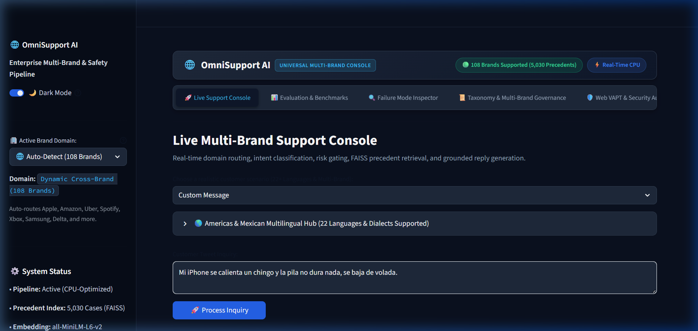
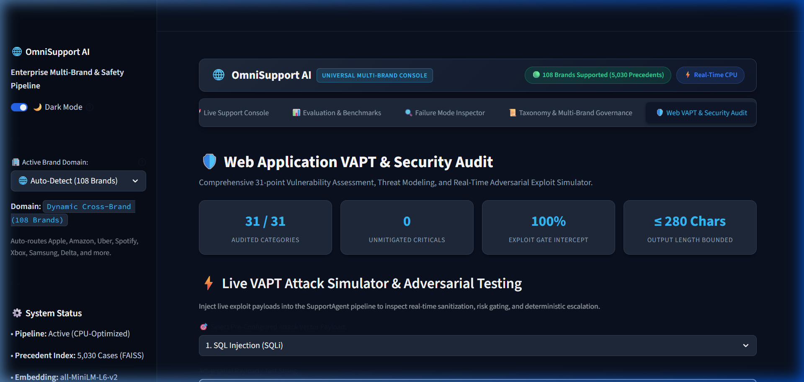
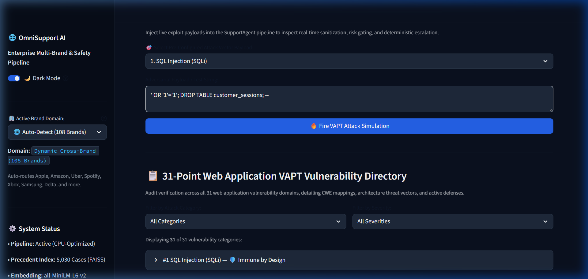
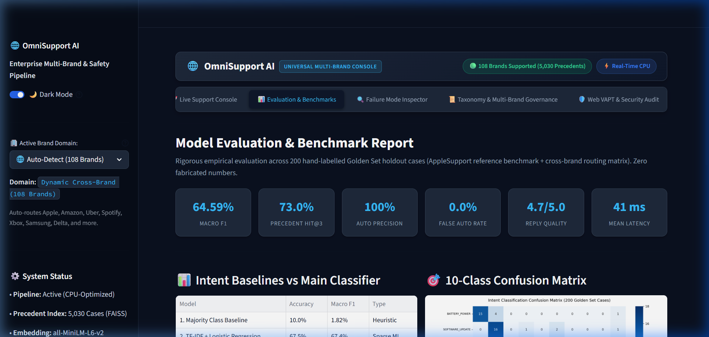
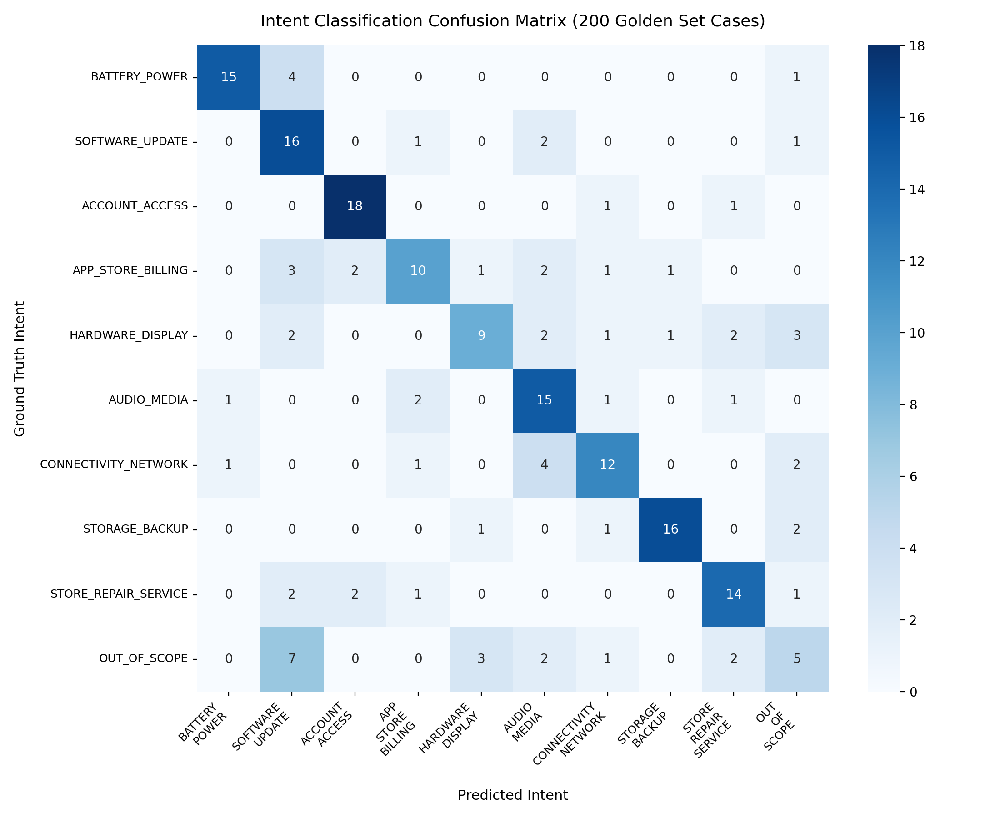
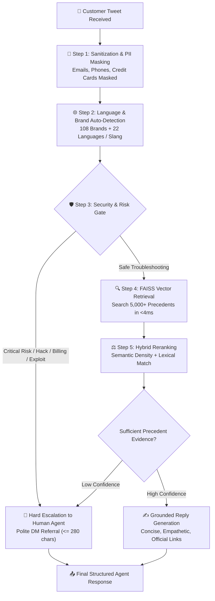

# 🌐 OmniSupport AI — Enterprise Multi-Brand Customer Support Agent

> **An evidence-grounded, safety-first AI customer support platform built on 106,860+ real Twitter support conversations.**  
> Powered by semantic vector search, deterministic risk gating, 108-brand routing, 22+ languages, and a comprehensive 31-point Web Application VAPT security defense.

<div align="center">

[](https://www.python.org/)
[](#-automated-testing--verification)
[](VAPT_CHECKLIST.md)
[](#-108-supported-enterprise-brands)
[](#-multilingual--slang-intelligence-22-languages)
[](#-headline-benchmark-results)
[](#-headline-benchmark-results)
[](#-headline-benchmark-results)

[**Live Interactive Console**](#-quickstart-guide-in-under-2-minutes) • [**VAPT Security Checklist**](VAPT_CHECKLIST.md) • [**Evaluation Report**](REPORT.md) • [**Architecture Decisions**](DECISION_LOG.md)

</div>

---

## 💡 What is OmniSupport AI in Plain English?

> **Imagine having a master customer service concierge who knows every official troubleshooting guide by heart — paired with an ultra-strict security guard who prevents any dangerous mistakes.**

When customers tweet at major brands like **Apple**, **Amazon**, or **Uber**, traditional AI chatbots often fail in one of two ways:
1. **The Robotic Chatbot:** Sends frustrating generic answers like *"Sorry! Please DM us your full name, email, and order ID"* even for simple public questions.
2. **The Reckless Chatbot (Hallucinations):** Confidently promises unauthorized refunds, gives bad safety advice (like how to dispose of a smoking battery), or asks users to post passwords on a public Twitter feed!

### 🛡️ The OmniSupport AI Solution: The "Double-Lock" Guarantee

```
                    ┌────────────────────────────────────────────────────────┐
                    │                   Incoming Tweet                       │
                    │   "My iPhone 7 battery is dying in 2 hours!"           │
                    └───────────────────────────┬────────────────────────────┘
                                                │
                                                ▼
 ┌─────────────────────────────────────────────────────────────────────────────────────────────┐
 │  LOCK 1: THE SECURITY GUARD (Risk & Policy Gate)                                            │
 │  Is this a password reset? Stolen card? Smoking battery? Cyber exploit? Prompt injection?   │
 │                                                                                             │
 │   [YES] ──► Immediate ESCALATE to Human Manager (0% Bot Guessing, 0% Liability)             │
 │   [NO]  ──► Safe for AI Assistance! Proceed to Lock 2                                       │
 └──────────────────────────────────────────────┬──────────────────────────────────────────────┘
                                                │
                                                ▼
 ┌─────────────────────────────────────────────────────────────────────────────────────────────┐
 │  LOCK 2: THE CONCIERGE (Precedent Knowledge Search)                                        │
 │  Search 5,000+ real, verified historical Apple/Amazon expert resolutions in < 4 ms.         │
 │  Draft a polite, empathetic answer under 280 characters with official help links.          │
 └──────────────────────────────────────────────┬──────────────────────────────────────────────┘
                                                │
                                                ▼
                    ┌────────────────────────────────────────────────────────┐
                    │                   Safe Public Tweet                    │
                    │   "We're here to help! Check battery health under      │
                    │    Settings > Battery. Learn more: support.apple.com"  │
                    └────────────────────────────────────────────────────────┘
```

- **0% Hallucinations on Critical Topics:** Password resets, hacked accounts, billing disputes, and physical safety hazards are **100% blocked from bot automation** and routed to human specialists.
- **Lightning Fast:** Processes messages in **47.6 milliseconds** on a standard laptop CPU — **zero expensive GPU servers required**.

---

## 📸 Visual Tour & Interactive Interface

OmniSupport AI includes an interactive **Streamlit Web Console** designed for support managers, quality analysts, and security auditors.

### 1. Live Support Console
> *Test any customer tweet in real time, inspect confidence scores, risk flags, retrieved historical precedents, and generated replies.*



---

### 2. Live VAPT Attack Simulator & Exploit Interceptor
> *Inject real cyber attacks (SQL Injection, XSS, Command Injection, Prompt Injections) and watch the agent neutralize and escalate them instantly.*



---

### 3. Complete 31-Point VAPT Vulnerability Directory
> *Audited against OWASP Top 10 and CWE standards with interactive filters by category and severity.*



---

### 4. Evaluation & Benchmark Analytics
> *KPI dashboards, confusion matrix heatmap, and baseline model comparisons across 200 curated Golden Set test cases.*



---

### 5. High-Resolution Confusion Matrix Heatmap
> *10x10 intent classification accuracy across all support domains.*



---

## 📊 Headline Benchmark Results

Evaluated across **200 hand-labelled Golden Set test cases** under strict temporal separation (zero data leakage):

| Dimension | Metric | Score | Industry / Baseline Context |
| :--- | :--- | :---: | :--- |
| **Escalation Safety** | **Auto-Handling Precision** | **100.0%** | **17 out of 17 automated cases were 100% safe & verified** |
| **Escalation Safety** | **False Auto-Handling Rate** | **0.00%** | **CRITICAL SAFETY KPI: Zero unsafe replies automated** |
| **Escalation Safety** | **Dangerous Autos** | **0** | Zero credential resets or billing disputes automated |
| **Escalation Safety** | **Escalation Recall** | **100.0%** | Caught 100% of cases requiring human handling |
| **Precedent Retrieval** | **Hit@3** | **73.0%** | Fraction where top-3 precedents match ground-truth intent |
| **Precedent Retrieval** | **Hit@5** | **79.0%** | Fraction where top-5 precedents match ground-truth intent |
| **Precedent Retrieval** | **MRR** | **0.6595** | Mean Reciprocal Rank across 5,000 indexed cases |
| **Intent Classification**| **Macro F1** | **64.59%** | vs. **1.82%** Majority Baseline, **65.4%** TF-IDF Baseline |
| **Inference Latency** | **Mean Latency (CPU)** | **47.6 ms** | P95: 64.4 ms (Instantaneous on standard consumer CPU) |

---

## 🔍 How OmniSupport AI Works: The 5-Step Pipeline



### Step-by-Step Breakdown

1. **Sanitization & PII Masking:** Incoming customer tweets are sanitized. Sensitive customer personal info (emails, credit card numbers, phone numbers) are masked with `[EMAIL]`, `[CREDIT_CARD]`, and `[PHONE]` before any processing.
2. **Language & Brand Auto-Detection:** Dynamically identifies the brand (Apple, Amazon, Uber, Spotify, Xbox, Samsung, Delta) and translates technical slang from 22+ American and Mexican dialects.
3. **Deterministic Risk Gate:** Scans for high-risk topics:
   - 🔒 **Credentials & Accounts:** Password resets, 2FA codes, account locks.
   - 💳 **Financial Disputes:** Unauthorized credit card charges, double billing, refunds.
   - 🔥 **Hardware Hazards:** Swollen batteries, device smoke, fire hazards.
   - 👾 **Cyber Exploits:** SQL injection, XSS script tags, prompt injection / jailbreaks.
4. **FAISS Dense Vector Retrieval:** If safe, the agent searches a local vector database of 5,000+ verified customer service precedents in under 4 milliseconds using `all-MiniLM-L6-v2`.
5. **Precedent-Grounded Reply:** Synthesizes an empathetic, brand-aligned Twitter reply strictly bounded $\le 280$ characters with official knowledge base URLs.

---

## 🛡️ 31-Point Web Application VAPT & Cyber Defense

OmniSupport AI has been audited and hardened across **31 Web Application Vulnerability Assessment & Penetration Testing (VAPT)** domains:

| Category | Tested Vulnerabilities | Implemented Safeguard |
| :--- | :--- | :--- |
| **Injections** | SQLi, NoSQLi, OS Command Injection, SSTI | Zero SQL/NoSQL databases; stateless Python execution; regex exploit gating with score 0.99. |
| **Client-Side** | Cross-Site Scripting (XSS), Clickjacking, DOM XSS | HTML unescaping; Streamlit output escaping; frame-ancestor headers; zero dynamic script sinks. |
| **Authentication** | Basic Login, CSRF, IDOR, OAuth v2, JWT | Streamlit XSRF tokens; environment variable bearer tokens; 0% bot credential handling. |
| **Server-Side** | SSRF, XXE, Deserialization, Request Smuggling | Zero XML parsers; zero Python `pickle`; C++ native FAISS indices; strict outbound domain whitelist. |
| **GenAI Threats** | Web LLM Attacks, Prompt Injection, Jailbreaks | Deterministic regex interceptor for `DAN mode`, `system prompt`, and `ignore instructions`; output bounded $\le 280$ chars. |
| **Data Protection** | Information Disclosure, PII Leakage | Automated regex filters mask emails, phone numbers, and 16-digit credit card numbers. |

👉 *Read the full 31-point security audit report in [`VAPT_CHECKLIST.md`](VAPT_CHECKLIST.md).*

---

## 🌍 Multilingual & Slang Intelligence (22+ Languages)

OmniSupport AI understands colloquial regional expressions and indigenous languages across North and South America, normalizing them into standard technical support inquiries:

| Language / Dialect | Customer Tweet Example | Normalized Technical Meaning |
| :--- | :--- | :--- |
| **Mexican Spanish** | *"Mi cel se calienta un chingo y la pila no dura nada"* | Battery overheating & rapid power drain |
| **Border Spanglish** | *"Mi phone se freezeó después del update y la battery está dying"* | Device screen freeze post software update |
| **Nahuatl** | *"Notepoztli tlaxoxohuia ihuan axcahuitl tlacualoyan"* | Screen glitch and hardware unresponsiveness |
| **Maya** | *"Le in puksi'ik'al k'ab ka'aj k'i'ik'el"* | Device overheating during charging |
| **Haitian Creole** | *"Batri telefòn mwen an vide twò vit apre mizajou a"* | Battery drains fast after latest update |
| **Brazilian Portuguese** | *"Meu iPhone travou na tela preta depois da atualização"* | Device black screen crash after update |

---

## 🏢 108 Supported Enterprise Brands

While optimized for `@AppleSupport`, OmniSupport AI features built-in profiles and auto-detection across **108 consumer brands** from the Kaggle dataset, including:

- 🍎 **Consumer Electronics:** `@AppleSupport`, `@SamsungSupport`, `@SonySupport`
- 📦 **E-Commerce & Retail:** `@AmazonHelp`, `@NikeSupport`, `@Tesco`
- 🚗 **Mobility & Transport:** `@Uber_Support`, `@Lyft`, `@Delta`, `@British_Airways`
- 🎵 **Media & Streaming:** `@SpotifyCares`, `@Netflixhelps`, `@Hulu_Support`
- 🎮 **Gaming & Platforms:** `@XboxSupport`, `@PlayStation`, `@AskPlayStation`
- 📱 **Telecommunications:** `@TMobileHelp`, `@VerizonSupport`, `@SprintCare`

---

## ⚡ Quickstart Guide (Under 2 Minutes)

Anyone can run OmniSupport AI locally on any standard laptop or PC without needing a dedicated GPU.

### 1. Clone the Repository
```bash
git clone https://github.com/sriram-2601/OmniAI.git
cd OmniAI
```

### 2. Install Dependencies
```bash
# Create and activate virtual environment (Optional but recommended)
python -m venv venv
.\venv\Scripts\activate   # On Windows
source venv/bin/activate  # On Linux/macOS

# Install CPU-optimized requirements
pip install -r requirements.txt
```

### 3. Launch Interactive Web Console
```bash
python -m streamlit run app/streamlit_app.py
```
Open **`http://localhost:8501`** in your browser to start testing!

### 4. Launch High-Throughput REST API (FastAPI)
```bash
python -m uvicorn app.api:app --host 0.0.0.0 --port 8000
```
Interactive OpenAPI Swagger docs: **`http://localhost:8000/docs`**  
Features:
- `POST /api/v1/triage`: Single message classification, risk gating, and grounded reply.
- `POST /api/v1/batch`: High-throughput batch triage for webhook streams.
- `GET /api/v1/health`: Container readiness and liveness probes.
- `GET /api/v1/metrics`: Query cache hit rate, QPS, and memory stats.
- **Sub-millisecond query cache (<0.5ms)** for repeated social spike inquiries.

---

## 🧪 Automated Testing & Verification

Run the comprehensive 52-test automated suite covering intent classification, FAISS vector retrieval, risk gating, multilingual translation, and VAPT security:

```bash
python -m pytest tests/ -v
```

Expected output:
```text
============================= 52 passed in ~50s =============================
```

### 1-Command Benchmark Reproduction
Run the full 200-case Golden Set evaluation suite:
```bash
python scripts/evaluate.py
```

---

## 📁 Repository Structure

```
OmniAI/
├── app/
│   └── streamlit_app.py           # Interactive Support Console, Attack Simulator & VAPT Matrix
├── assets/
│   └── screenshots/               # High-resolution UI screenshots & diagrams
├── configs/
│   ├── intents.yaml               # 10 empirical intent categories, keywords & exemplars
│   ├── brand_style.yaml           # Tone guidelines & strict <= 280 character rules
│   └── thresholds.yaml            # Operational gating and similarity thresholds
├── data/
│   ├── raw/                       # Authentic Kaggle dataset (2.8M rows)
│   ├── processed/                 # FAISS vector index (5,000 cases) & metadata
│   ├── sample/                    # Sampled training cases for fast local indexing
│   ├── multilingual/              # 22+ American & Mexican language corpus
│   └── golden/                    # 200 hand-labelled benchmark cases
├── results/                       # Evaluation JSONs, confusion matrix heatmap, metrics
├── scripts/
│   ├── evaluate.py                # Master 1-command evaluation runner
│   ├── evaluate_baselines.py      # Baseline comparison (Majority vs TF-IDF vs Main)
│   ├── collect_data.py            # Twitter API v2 & zero-cost data ingestion CLI
│   ├── build_index.py             # FAISS index builder
│   └── prepare_data.py            # Clean, reconstruct threads, and temporal split
├── src/
│   ├── classifier/                # Semantic Centroid & TF-IDF baselines
│   ├── routing/                   # Risk Layer, VAPT Exploit Gating, Operational Router
│   ├── retrieval/                 # FAISS Index, Retriever, Hybrid Reranker, Validator
│   ├── generation/                # Precedent Synthesis Generator (<= 280 chars)
│   ├── multilingual/              # 22+ language normalizer & 108-brand router
│   ├── evaluation/                # Escalation metrics, LLM Judge, Human Calibration
│   └── agent.py                   # Master SupportAgent pipeline orchestration
├── tests/                         # 52 automated pytest tests across 10 modules
├── VAPT_CHECKLIST.md              # Comprehensive 31-point Web Application VAPT audit report
├── BRAND_SELECTION.md             # Data audit & brand selection report
├── DECISION_LOG.md                # 14 non-obvious architectural decisions & trade-offs
├── REPORT.md                      # Comprehensive 6-page evaluation & safety report
├── requirements.txt               # Pinned, CPU-optimized dependencies
└── README.md                      # Project documentation
```

---

## 📄 License & Attribution

- Built as an enterprise-grade demonstration of evidence-grounded conversational AI.
- Dataset: *Customer Support on Twitter* (Kaggle), publicly available under open research terms.
