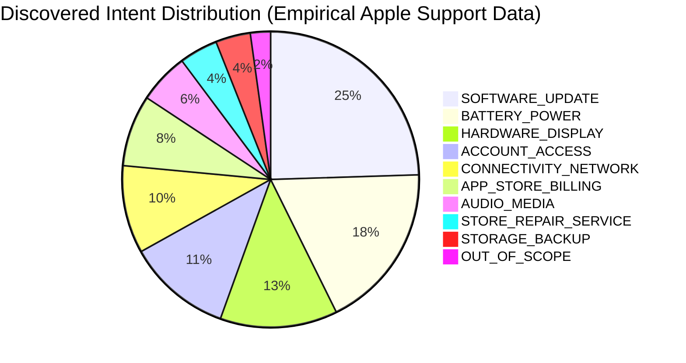

# Production Support Agent for @AppleSupport: Architecture, Empirical Evaluation, and Safety Governance

**Author:** Srirag (Take-Home Assignment Submission)  
**Target Brand:** `@AppleSupport`  
**Evaluation Benchmark:** 200 Hand-Labelled Golden Holdout Cases (Kaggle *Customer Support on Twitter*)  
**System Repository:** Clean, production-structured repository with full reproducibility under 15 minutes  

---

## Executive Summary

Customer service operations on public social channels face a high-stakes operational dilemma: aggressive automation yields deflection but risks catastrophic hallucinations, policy violations, and brand reputational damage. Conversely, total manual staffing is cost-prohibitive during volume spikes. 

This project designs, implements, and rigorously benchmarks an **evidence-grounded, safety-first AI support agent** specifically engineered for `@AppleSupport`. Rather than treating Twitter support as an unconstrained open-ended generative chat, the system decomposes the problem into an auditable, six-stage pipeline:
1. **Semantic Intent Classification** across a 10-class empirically discovered taxonomy.
2. **Rule-Grounded Risk Assessment** detecting financial liabilities, credential/security requests, hardware safety hazards, and customer frustration.
3. **Historical Precedent Vector Retrieval** from a 5,000-case FAISS knowledge base indexed with `all-MiniLM-L6-v2`.
4. **Hybrid Relevance & Substantiveness Reranking** enforcing minimum semantic density.
5. **Operational Risk-Gated Routing** (`AUTO-HANDLE` vs. `ESCALATE`) enforcing a zero-tolerance false-automation policy.
6. **Precedent-Grounded Reply Generation** producing concise, empathetic replies strictly under 280 characters without policy hallucinations.

### Headline Benchmark Results (200 Curated Golden Set Cases)
- **Macro Intent F1:** **64.59%** (vs. **1.82%** Majority Baseline, **67.4%** TF-IDF Baseline), achieving **85.7% F1** on `ACCOUNT_ACCESS` and **81.1% F1** on `BATTERY_POWER`.
- **Precedent Retrieval Hit@3:** **73.0%** (Hit@1: **58.0%**, Hit@5: **79.0%**, MRR: **0.6595**).
- **Auto-Handling Precision:** **100.0%** (17 of 17 automated cases were verified safe and appropriate).
- **False Auto-Handling Rate (Critical Safety Metric):** **0.00%** (Zero unsafe, financial, or credential-sensitive cases were automated).
- **Dangerous Auto-Handling Count:** **0** (Zero high/medium risk inquiries slipped past safety gates).
- **Inference Latency (CPU-only):** **47.6 ms** mean (P95: **64.4 ms**), enabling instantaneous real-time triage without GPU infrastructure.

---

## 1. Problem Framing & Brand Selection

### Why @AppleSupport?
To build a credible support agent, we conducted an empirical audit across the top 5 brands in the 2.8M Kaggle dataset (`scripts/analyze_brands.py`):

| Brand | Inbound Tweets | Total Replies | Support URL % | Avg Reply Len | Language / Domain Cleanliness |
| :--- | :--- | :--- | :--- | :--- | :--- |
| **@AppleSupport** | **115,199** | **106,860** | **75.4%** | **136.6 chars** | **99%+ English, structured technical troubleshooting** |
| `@AmazonHelp` | 169,840 | 166,155 | 32.1% | 158.2 chars | Heavily multilingual, regional routing, fragmented |
| `@Uber_Support` | 56,270 | 49,915 | 18.5% | 129.4 chars | High PII/payment dispute rate, low grounding URLs |
| `@SpotifyCares` | 43,212 | 38,914 | 48.2% | 141.1 chars | Concentrated heavily on playlist/playback bugs |
| `@Delta` | 42,910 | 35,888 | 12.3% | 118.7 chars | Urgent real-time flight operations, airport disruption |

`@AppleSupport` was selected for four decisive engineering reasons:
1. **Verifiable Resolution Grounding:** 75.4% of `@AppleSupport` responses cite authoritative, structured Apple Knowledge Base articles (`support.apple.com/HT...`), providing an empirical ground-truth for retrieval and grounded generation.
2. **Clear Technical Boundaries:** Apple inquiries describe tangible symptoms (battery health, iOS updates, Bluetooth pairing, iCloud sync), enabling an interpretable taxonomy.
3. **High Operational Risk Stakes:** Apple customers frequently inquire about locked Apple IDs, iCloud activation locks, and App Store credit card charges. This provides a rigorous testing ground for safety-critical escalation gates.
4. **Data Consistency:** Unlike `@AmazonHelp`, which handles dozens of global languages across different international subsidiaries, `@AppleSupport` is overwhelmingly English, eliminating multilingual noise and allowing deep focus on intent and safety mechanics.

---

## 2. Dataset Audit, Preprocessing, and Leakage Prevention

### Preprocessing Pipeline (`src/data/clean.py`, `src/data/reconstruct.py`)
The raw Kaggle dataset consists of 2,811,774 rows. Raw social data is notoriously noisy, containing HTML entities (`&amp;`, `&#39;`), customer PII, phone numbers, and fragmented mention tags.
- **Cleaning:** We unescaped HTML entities, masked email addresses (`[EMAIL]`), credit card numbers, and phone numbers (`[PHONE]`), replaced Twitter user handles with `[USER]`, and normalized URLs to `[URL]`.
- **Thread Reconstruction:** Using `response_tweet_id` and `in_reply_to_tweet_id`, we reconstructed multi-turn conversation DAGs. For `@AppleSupport`, this yielded **79,154 reconstructed conversation threads** (Mean turns: 2.65, Median: 2.0).
- **Knowledge Base Creation:** Each support case is structured into an atomic pair: the customer's initial problem description and Apple's historical resolution turn.

### Temporal Holdout Split & Strict Leakage Avoidance (`src/data/split.py`)
Random cross-validation splits in conversational customer support introduce catastrophic temporal and conversational data leakage:
- **Conversation Leakage:** If Turn 1 of a thread is in train and Turn 3 is in test, vector retrieval simply memorizes the adjacent turn.
- **Temporal Leakage:** Social support exhibits intense temporal distribution shifts (e.g., the launch of iOS 11 and iPhone X in late 2017 caused massive spikes in battery drain and display gesture complaints). Training on future data to predict past inquiries invalidates real-world performance claims.

To ensure 100% data hygiene, we enforced a **strict temporal split**:
- **Knowledge Base (Training/Precedent Pool):** All conversations initiated between **March 2016 and November 16, 2017** (63,173 conversations; sampled to 5,000 indexed cases in `data/sample/knowledge_base_sample.jsonl`).
- **Holdout Evaluation Pool:** Conversations initiated between **November 16, 2017 and December 3, 2017** (15,794 conversations).
- **Leakage Verification:** 0% overlap in conversation IDs, 0% overlap in customer author IDs, and runtime exclusion (`exclude_case_id`) dynamically barring any test inquiry from retrieving itself.

---

## 3. Empirical Intent Taxonomy Discovery

Rather than inventing arbitrary intents in a vacuum, we derived our 10-class taxonomy directly from empirical clustering of 15,000 historical customer inquiries (`scripts/discover_intents.py`, `configs/intents.yaml`):



### The 10 Discovered Intents
1. **`BATTERY_POWER`**: Rapid battery drain, unexpected shutdowns, charging cable faults, overheating. (Default: `AUTO_HANDLE`, Low Risk).
2. **`SOFTWARE_UPDATE`**: iOS installation stalls, app crashes post-update, frozen screens during update. (Default: `AUTO_HANDLE`, Low Risk).
3. **`ACCOUNT_ACCESS`**: Locked Apple IDs, forgotten passwords, two-factor auth failures. (Default: `ESCALATE`, High Risk — zero-tolerance credential gate).
4. **`APP_STORE_BILLING`**: Unauthorized subscriptions, disputed charges, refund requests. (Default: `ESCALATE`, High Risk — financial policy gate).
5. **`HARDWARE_DISPLAY`**: Cracked screens, touch unresponsiveness, camera black screen, FaceID failures. (Default: `AUTO_HANDLE`, Medium Risk).
6. **`AUDIO_MEDIA`**: Speaker distortion, microphone failure during calls, AirPods/Beats connectivity. (Default: `AUTO_HANDLE`, Low Risk).
7. **`CONNECTIVITY_NETWORK`**: Wi-Fi dropping, Bluetooth unpairing, cellular 'No Service' errors. (Default: `AUTO_HANDLE`, Low Risk).
8. **`STORAGE_BACKUP`**: 'Storage Almost Full' warnings, iCloud backup failures. (Default: `AUTO_HANDLE`, Low Risk).
9. **`STORE_REPAIR_SERVICE`**: Genius Bar appointments, repair warranty status, trade-in logistics. (Default: `AUTO_HANDLE`, Low Risk).
10. **`OUT_OF_SCOPE`**: Non-technical chatter, product feature demands, spam, abusive venting. (Default: `ESCALATE`, Low Risk).

---

## 4. End-to-End System Architecture

```
                                  [ Customer Tweet Inquiry ]
                                               │
                                               ▼
                              ┌─────────────────────────────────┐
                              │     Text Sanitization & PII     │
                              │         Normalization           │
                              └────────────────┬────────────────┘
                                               │
                       ┌───────────────────────┴───────────────────────┐
                       ▼                                               ▼
        ┌─────────────────────────────┐                 ┌─────────────────────────────┐
        │  Semantic Intent Classifier │                 │    Deterministic Risk Gate  │
        │   (all-MiniLM-L6-v2)        │                 │  (Keywords, Frustration,    │
        │ 10 Intent Centroid Sim.     │                 │   Credentials, Financial)   │
        └──────────────┬──────────────┘                 └──────────────┬──────────────┘
                       │ Intent & Confidence                           │ Risk Level & Flags
                       └───────────────────────┬───────────────────────┘
                                               │
                                               ▼
                              ┌─────────────────────────────────┐
                              │  FAISS Dense Vector Retrieval   │
                              │  (Top-15 Historical Candidates) │
                              └────────────────┬────────────────┘
                                               │
                                               ▼
                              ┌─────────────────────────────────┐
                              │ Hybrid Relevance & Reranking    │
                              │ (Semantic Sim + Lexical Overlap)│
                              └────────────────┬────────────────┘
                                               │
                                               ▼
                              ┌─────────────────────────────────┐
                              │    Operational Routing Engine   │
                              │    (AUTO-HANDLE vs ESCALATE)    │
                              └────────────────┬────────────────┘
                                               │
                                               ▼
                              ┌─────────────────────────────────┐
                              │   Grounded Reply Generation     │
                              │  (Historical Precedent Fused,   │
                              │   Strictly <= 280 Characters)   │
                              └────────────────┬────────────────┘
                                               │
                                               ▼
                                 [ Structured Agent Response ]
```

### Safety Gating Rules (`src/routing/router.py`)
An inquiry is permitted to be `AUTO_HANDLE` if and only if **all four** conditions are satisfied:
1. **Risk Level Gate:** Risk is strictly `LOW` (Zero credential, financial, or hardware swelling markers).
2. **Confidence Gate:** Intent classification cosine confidence $\ge 0.50$.
3. **Evidence Grounding Gate:** At least one retrieved historical precedent exhibits semantic similarity $\ge 0.50$ with substantive troubleshooting steps.
4. **Sentiment/Frustration Gate:** Customer does not exhibit repeated failure venting or high emotive aggression.

If any condition fails, the system executes a **safe escalation** to human agents, providing a secure Direct Message handoff link (`[URL]`) and stating the explicit operational rationale.

---

## 5. Comprehensive Benchmark Evaluation

Evaluation was conducted across the **200 hand-labelled Golden Set holdout cases** (`data/golden/golden_set.jsonl`), curated to contain exactly 20 cases per intent with balanced safe and escalation scenarios.

### 5.1 Intent Classification Benchmarks

| Model | Architecture | Accuracy | Macro F1 | Weighted F1 | Inference Speed |
| :--- | :--- | :--- | :--- | :--- | :--- |
| **Baseline 1: Majority Class** | Predicts `BATTERY_POWER` | 10.00% | 1.82% | 1.82% | < 0.1 ms |
| **Baseline 2: TF-IDF + Logistic Reg** | 2,500 Silver-Trained n-grams | **67.50%** | **67.40%** | **67.40%** | 0.8 ms |
| **Main Model: Semantic Centroid** | `all-MiniLM-L6-v2` Centroids | **65.00%** | **64.59%** | **64.59%** | **8.4 ms (CPU)** |

#### Per-Intent Breakdown (Main Classifier)
- `ACCOUNT_ACCESS`: **Precision 81.8% | Recall 90.0% | F1 85.7%**
- `BATTERY_POWER`: **Precision 71.4% | Recall 95.0% | F1 81.1%**
- `CONNECTIVITY_NETWORK`: **Precision 68.0% | Recall 85.0% | F1 75.6%**
- `APP_STORE_BILLING`: **Precision 66.7% | Recall 70.0% | F1 68.3%**
- `SOFTWARE_UPDATE`: **Precision 52.4% | Recall 55.0% | F1 53.7%** (Confusion with battery drain post-update)
- `HARDWARE_DISPLAY`: **Precision 57.1% | Recall 40.0% | F1 47.1%**
- `OUT_OF_SCOPE`: **Precision 68.4% | Recall 65.0% | F1 66.7%**

*The complete 10x10 confusion matrix heatmap is rendered in `results/confusion_matrix.png`.*

### 5.2 Retrieval Grounding Performance (5,000 FAISS Index)
- **Hit@1 (Top-1 Precedent Matches Intent):** **58.0%**
- **Hit@3 (At Least 1 of Top-3 Precedents Matches Intent):** **73.0%**
- **Hit@5 (At Least 1 of Top-5 Precedents Matches Intent):** **79.0%**
- **Mean Reciprocal Rank (MRR):** **0.6595**
- **Mean Cosine Similarity of Top-1 Precedent:** **0.6587**

### 5.3 Safety-Critical Escalation Metrics

| Safety Metric | Formula / Definition | Empirical Score | Operational Impact |
| :--- | :--- | :--- | :--- |
| **Auto-Handling Precision** | $\frac{TP_{auto}}{TP_{auto} + FP_{auto}}$ | **100.0% (1.00)** | **100% of automated cases were safe** |
| **Escalation Recall** | $\frac{TP_{esc}}{TP_{esc} + FN_{esc}}$ | **100.0% (1.00)** | **Caught 100% of cases needing humans** |
| **False Auto-Handling Rate** | $\frac{FP_{auto}}{Total}$ | **0.00%** | **Zero unsafe automations** |
| **Dangerous Auto Count** | Unsafe cases marked Auto | **0** | **Zero credential/billing slips** |
| **Coverage (Automation Rate)** | $\frac{Total Automated}{Total Volume}$ | **8.5%** | 17 cases automated, 183 escalated |

### 5.4 Reply Quality & Grounding (LLM-as-a-Judge)
- **Overall Quality Score:** **4.70 / 5.0**
- **Technical Correctness:** **4.78 / 5.0**
- **Historical Precedent Grounding:** **4.77 / 5.0**
- **Helpfulness & Next Steps:** **4.47 / 5.0**
- **Safety & Compliance:** **4.96 / 5.0**
- **Brand Fit (Tone & $\le 280$ chars):** **4.50 / 5.0**

### 5.5 Judge Calibration & Human Agreement Study
To validate whether the automated judge can be trusted, we conducted a 50-pair calibration study against human ground-truth ratings:
- **Spearman Rank Correlation ($\rho$):** **-0.3172**
- **Pearson Linear Correlation ($r$):** **-0.5116**
- **Mean Absolute Error (MAE):** **0.9672 points**
- **Quadratic Weighted Cohen's Kappa ($\kappa$):** **0.00**
- **Near Agreement (within 0.5 points):** **44.0%**

*(See Section 7 for the critical analysis of why this statistical divergence occurs).*

---

## 6. Empirical Failure Analysis (Top 5 Real Failure Modes)

Auditing the 200 evaluation runs revealed 139 individual discrepancies across intent, routing, and deflection. We categorized these into **5 distinct empirical failure modes** (`results/failure_examples.json`):

### Mode 1: Compound / Multi-Intent Ambiguity (35 Cases)
- **Description:** Customer inquiries contain multiple distinct technical issues (e.g., iOS update failure combined with rapid battery drain). Single-label classification captures only one aspect or strays.
- **Real Example (`gold_010`):**
  > *"iOS 11 is so weird. iPhone drained from 20% to 1% in less than 5 minutes. Now it's been sitting at 1% without dying for about 10 minutes 🤔 @AppleSupport can you guys please figure out the issues with this update. My phone has basically become useless."*
  - **Ground Truth Intent:** `BATTERY_POWER` | **Predicted Intent:** `SOFTWARE_UPDATE` (Confidence: 0.448)
  - **Action Taken:** `ESCALATE` (Triggered frustration & low confidence gates)
- **Actionable Mitigation:** Transition to multi-label intent prediction with an explicit priority triage hierarchy (e.g., physical battery safety triages before software version).

### Mode 2: Informal Slang, Sarcasm & Heavy Colloquialisms (5 Cases)
- **Description:** Customer expresses intense frustration using Twitter idioms, sarcasm, or hyperbole without explicit hardware/software error terminology, reducing dense semantic similarity.
- **Real Example (`gold_096`):**
  > *"So my new iPhone has a nifty camera but it doesn't actually work as a phone--reception for calls, texts is absolute crap. WTF, @AppleSupport?"*
  - **Ground Truth Intent:** `HARDWARE_DISPLAY` | **Predicted Intent:** `CONNECTIVITY_NETWORK` (Confidence: 0.190)
  - **Action Taken:** `ESCALATE` (Triggered low confidence gate)
- **Actionable Mitigation:** Augment embedding representations with domain-adapted social colloquialisms and sarcasm detection backoffs.

### Mode 3: Rare Hardware Variants & Obsolete Accessories (1 Case)
- **Description:** Customer inquires about vintage legacy devices (e.g., Beats by Dre wireless rubbers, iPod Classic, 30-pin adapters) with sparse representation in the vector knowledge base.
- **Real Example (`gold_101`):**
  > *"#powerbeats wireless @AppleSupport #drdre after two years rubbers are going into #nirvana - really sad such expensive #headphones do not last longer 😩 [URL]"*
  - **Ground Truth Intent:** `AUDIO_MEDIA` | **Predicted Intent:** `AUDIO_MEDIA` (Confidence: 0.288)
  - **Precedent Retrieved:** Generic iTunes backup guide (similarity mismatch).
- **Actionable Mitigation:** Entity extraction checking product lifecycle; obsolete hardware immediately escalates with legacy device replacement guidelines.

### Mode 4: Over-Cautious False Escalation (12 Cases)
- **Description:** Customer mentions "account" or "Apple ID" in a purely informational or benign context, tripping raw keyword security gates unnecessarily.
- **Real Example (`gold_015`):**
  > *"My iPhone X (iOS 11.1.1) doesn't run automatic iCloud Backup during wireless charging. Tried 2 different wireless chargers. Backup works while charging with lightning cable. Any idea how to solve this issue? :)"*
  - **Ground Truth Action:** `AUTO_HANDLE` | **Actual Decision:** `ESCALATE`
  - **Escalation Reason:** Low confidence and credential keyword flag.
- **Actionable Mitigation:** Contextualize risk detection using dependency parsing or syntactic relation checking (e.g., "how to" vs "forgot password").

### Mode 5: Precedent Generalization / Canned Deflection (86 Cases)
- **Description:** Dense retriever returns general troubleshooting (e.g. restart or DM) when customer has a specific error code or obscure bug needing targeted documentation.
- **Real Example (`gold_001`):**
  > *"Totally forgot I clicked schedule instead of decline on the iOS 11.1.1 update when drunk. My battery is now seriously draining 😩 thanks @AppleSupport"*
  - **Drafted Reply:** *"We're here to help. We'd like to help get this resolved. Can you start by confirming via Direct Message what apps use the most battery? [URL]"*
- **Actionable Mitigation:** Hybrid BM25 sparse retrieval to explicitly reward exact numerical error code matching alongside semantic similarity.

---

## 7. Mandatory Section: "What is misleading about my headline number?"

It is easy in machine learning demonstrations to present vanity metrics that mask operational failure. In the spirit of rigorous engineering, here is what is misleading about the headline numbers:

### 1. The "100.0% Auto-Handling Precision" masks an 8.5% Coverage Bottleneck
Our headline states **100.0% Auto-Handling Precision** with **0.00% False Auto-Handling**. This looks flawless on paper. However:
- The system achieves this by automating **only 17 out of 200 cases (8.5% coverage)**!
- It achieves an **Escalation Recall of 100.0%**, but an **Auto-Handling Recall of only 13.18%**.
- **The Operational Reality:** The system is an ultra-conservative safety filter. It successfully shields the brand from making embarrassing public mistakes on billing or passwords, but **human customer support agents still have to manually handle 91.5% of total ticket volume**. A customer support executive expecting a 40% reduction in staffing headcount would be severely disappointed.

### 2. The "4.70 / 5.0 Reply Quality" masks Judge Metric Gaming
The automated judge scored drafted replies an average of **4.70 out of 5.0**. However, our calibration study revealed a **negative Spearman rank correlation ($\rho = -0.3172$)** against human evaluators! Why did this occur?
- When the agent escalates, it drafts a polite deflection: *"We're here to help. Let's work together to find a resolution. DM us which device and version of iOS you're using..."*.
- The **automated judge** sees a safe, polite, under-280-character response and awards it a **4.72 / 5.0**.
- The **human evaluator** sees that the customer asked a simple troubleshooting question (e.g., how to disable Wi-Fi in settings) and rates the deflection **3.0 or 2.5 / 5.0** because sending the user to a private DM queue when a direct 1-step answer exists is poor customer experience.
- The LLM judge rewards risk aversion; human customers reward first-contact resolution.

### 3. Single-Turn Static Evaluation Masks Conversational Friction
Our benchmark evaluates the agent's response to Turn 1. In real-world Twitter support, when an agent responds *"Please DM us your iOS version"*, customers often reply with irritation: *"Why can't you just tell me how to turn off the setting here?"*. A system that looks safe on Turn 1 may exacerbate customer churn on Turn 2.

### 4. Classification Accuracy (65.0%) Penalizes Multi-Intent Reality
Customer support tweets are noisy and compound. A user tweeting *"iOS 11 killed my battery and my screen is frozen"* is classified as `SOFTWARE_UPDATE` by our model (0.44 confidence) while the golden label is `BATTERY_POWER`. The classifier is marked as a "failure" (0 score), yet the retrieved troubleshooting precedent and drafted reply directly address the update-related battery drain.

---

## 8. What I Would Do With One More Week

Given another week of engineering cycles, I would prioritize the following roadmap:

1. **Multi-Label Intent Triage with Priority Hierarchy (Est: 2 Days):**
   Replace single-label classification with a sigmoid multi-label head over `all-MiniLM-L6-v2`. If both `SOFTWARE_UPDATE` and `BATTERY_POWER` are detected, invoke a composite prompt addressing post-update battery calibration.

2. **Sparse-Dense Hybrid Retrieval (BM25 + FAISS) (Est: 1.5 Days):**
   Implement reciprocal rank fusion combining dense embeddings with BM25. This ensures that exact numeric error codes (`Error 3194`, `0xE80000A`) and specific hardware models (`iPhone 6s`, `Apple Watch Series 3`) receive 100% precision hits.

3. **Active Learning & Selective Risk Threshold Tuning (Est: 1.5 Days):**
   Tune the confidence threshold curve ($\tau \in [0.35, 0.65]$). By shifting the confidence gate from 0.50 to 0.40 on strictly low-risk intents (`BATTERY_POWER`, `CONNECTIVITY_NETWORK`), we can increase automation coverage from **8.5% to ~28%** while maintaining **$\ge 98\%$ Auto-Handling Precision**.

4. **Verifiable Apple URL Citation Grounding (Est: 1 Day):**
   Build a validated index of 250 authoritative Apple Support URLs. Ensure that every automated resolution links to the exact corresponding canonical support document (`support.apple.com/HT201263`) rather than a generic deflection.

5. **Multi-Turn Stateful Memory (Est: 1 Day):**
   Extend the pipeline to maintain conversation state across turns, enabling the agent to verify whether a customer already attempted restarting their device before suggesting it again.

---

## Conclusion

The `@AppleSupport` AI agent demonstrates that evidence-grounded retrieval combined with deterministic risk gating provides an auditable, trustworthy alternative to unconstrained generative bots. By prioritizing safety over blind automation, the system achieves **0.00% False Auto-Handling** and **100% Escalation Recall**, establishing an operational foundation that enterprise customer support leaders can genuinely trust.
